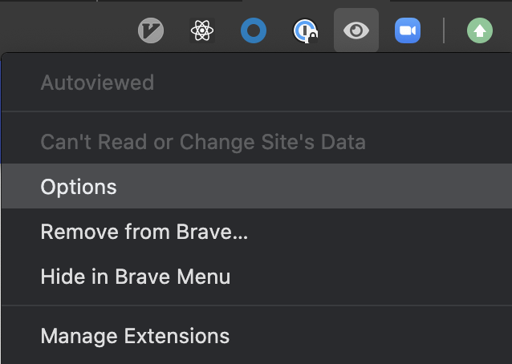
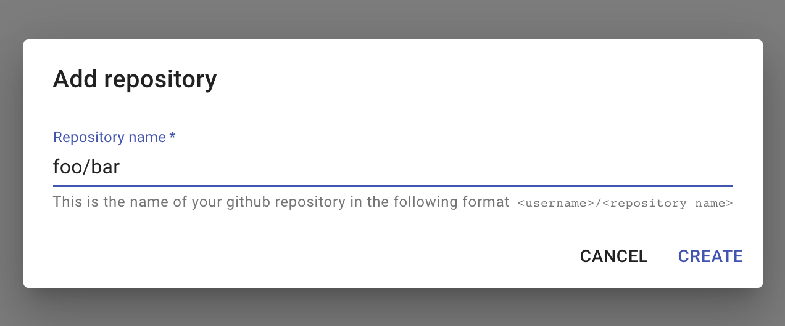
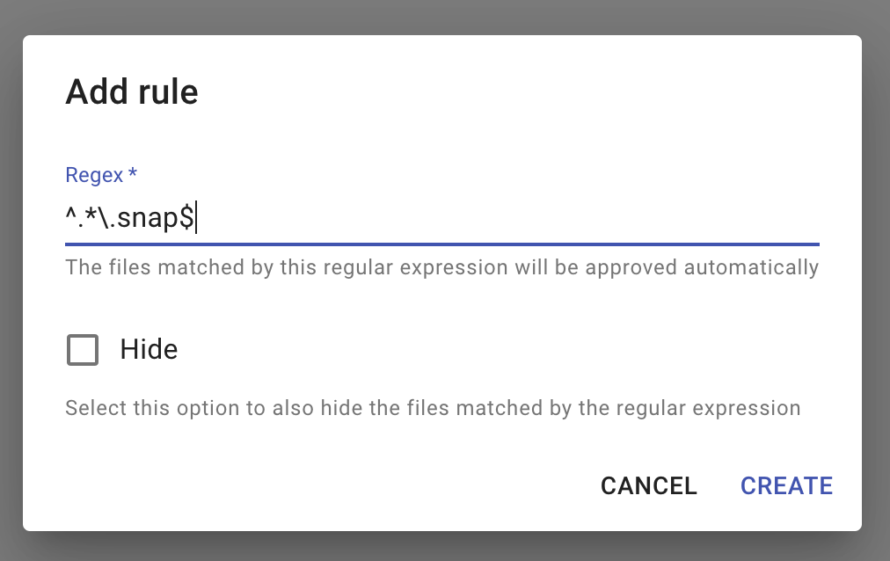
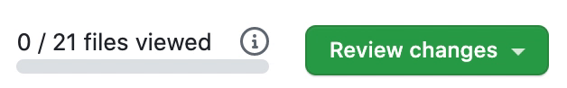

# Introduction

This Chrome extension will help you deal with the files _you don't want to review_ in your GitHub pull requests.

## Installation

Easy peasy, just go to <https://chrome.google.com/webstore/detail/autoviewed/occcjmolphcfebdeichmoflmfgeefjef> and click `Add to Chrome`. It also works on the awesome Brave browser.

## Use cases

Hide auto-generated files you might have in your repository.
I know, I know, you shouldn't have auto-generated files in your git repository, but you know, sometimes you do. I'm not here to judge you.

Your teammates insist in creating jest snapshots for their React components and you just don't want to waste your time reviewing them.

## How does it work?

First you need to configure the extension:

1. Right click on the extension button and select `Options`.
   
1. Add the repositories in which you want the extension to be enabled.
   
1. Add a regular expression to match the files you want to mark as viewed automatically.
   
1. Go to a pull request and select `Files changed` tab.
   
1. See the `viewed` progress bar moving.
   
